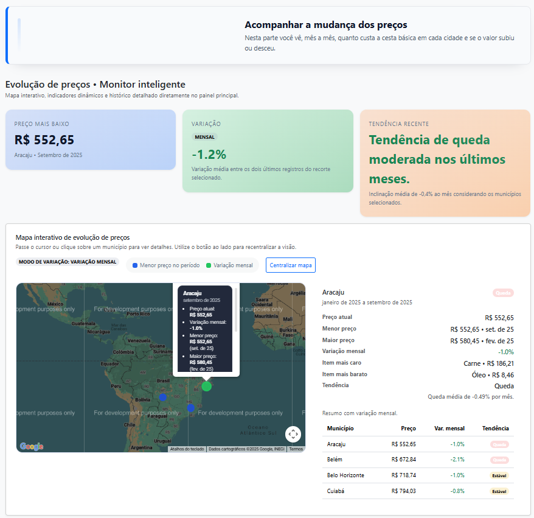
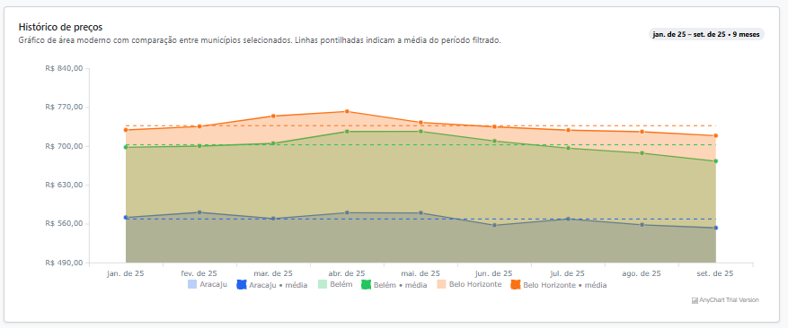
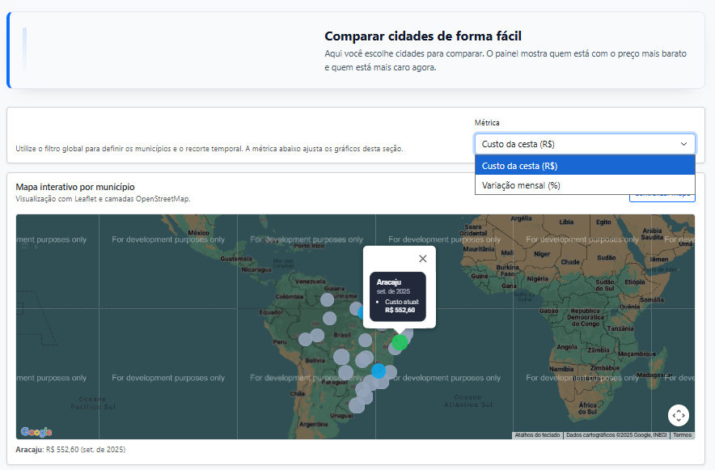

# Plataforma de Análise da Cesta Básica

Aplicação web desenvolvida como parte do Trabalho de Conclusão de Curso em Sistemas de Informação da Universidade Federal Fluminense (UFF), Instituto de Computação (IC).  
A plataforma investiga o custo da cesta básica no Brasil, combinando dados oficiais e ferramentas analíticas para apoiar pesquisas acadêmicas e decisões em políticas públicas.

## 🎯 Objetivo da Aplicação e Base Científica

A Plataforma de Análise da Cesta Básica oferece um painel interativo para:

- Explorar a **evolução de preços** dos itens essenciais.
- **Comparar municípios** e capitais brasileiras.
- Identificar **padrões de variação, sazonalidade e assimetrias regionais**.
- Relacionar o custo da cesta com **inflação e eventos externos**.

As visualizações e indicadores são fundamentados em dados do DIEESE, além de análises produzidas no contexto do artigo científico do TCC.

## 📚 Eixos Analíticos da Pesquisa

- **Evolução dos preços**
- **Comparação regional**
- **Impacto da inflação**
- **Peso dos itens**
- **Influência de eventos externos**

## 📊 Funcionalidades Principais

1. **Evolução dos preços**
2. **Comparação regional**
3. **Peso dos itens**
4. **Influência de eventos externos**

## 💻 Arquitetura e Tecnologias Utilizadas

- **Back-end:** Spring Boot 3.5.5, Java 21  
- **Front-end:** JSP, HTML5, CSS3, JavaScript, Bootstrap 5  
- **Banco de Dados:** Microsoft SQL Server  
- **Versionamento:** Git e GitHub


##  Painel Analítico da Cesta Básica








## 🗂️ Estrutura do Repositório

```text
ProjetoFinal-LuisAdriano/
├── pom.xml
├── src/
│   ├── main/
│   │   ├── java/
│   │   ├── resources/
│   │   └── webapp/
│   └── test/
└── README.md
```

## ⚙️ Instalação e Execução Local

1. **Clonar o repositório**

```bash
git clone https://github.com/adrianoavlis/ProjetoFinal-LuisAdriano.git
cd ProjetoFinal-LuisAdriano
```

2. **Configurar o banco de dados SQL Server**

3. **Instalar dependências**

```bash
mvn clean install
```

4. **Executar a aplicação**

```bash
mvn spring-boot:run
```

5. **Acessar o painel**

Acesse:  
http://localhost:8081

## 👤 Autores e Créditos

- **Luis Adriano da Silva** – Desenvolvedor e autor do TCC  
- **Prof. João Felipe Pimentel** – Orientador, IC/UFF
